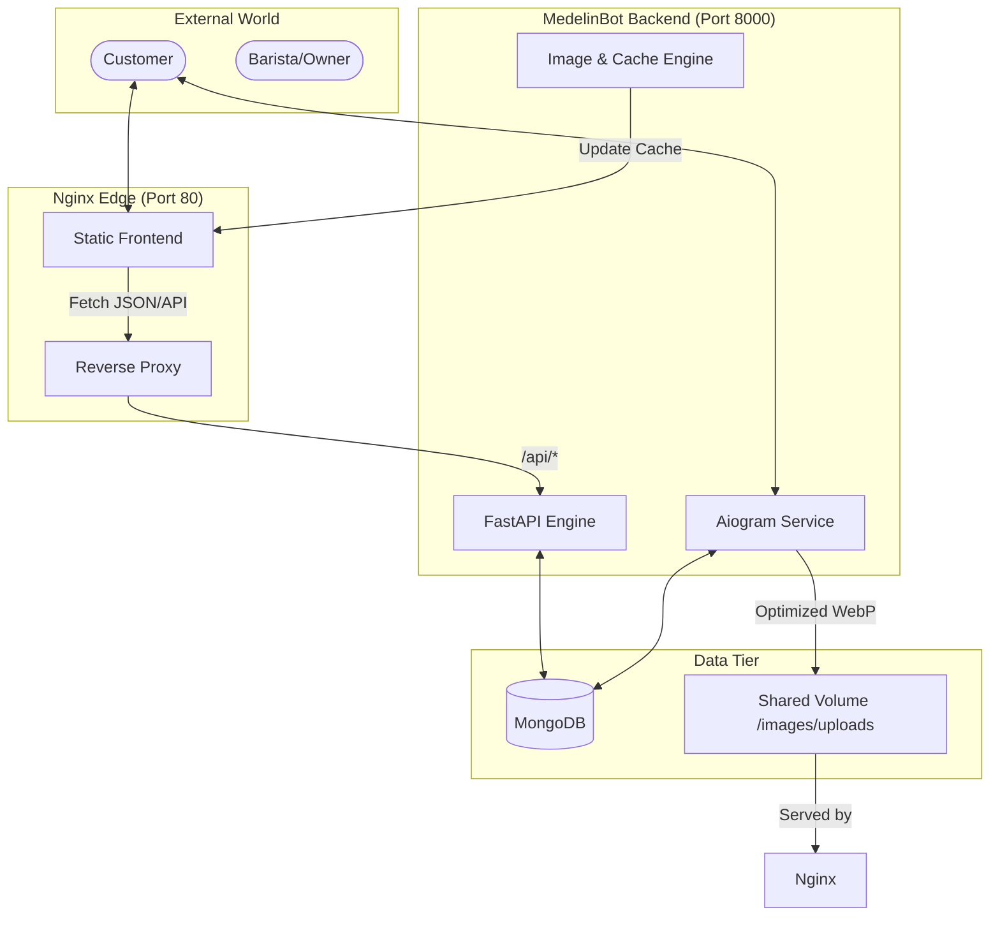

# ☕ Medelin — Coffee Shop Digital Ecosystem 

<div align="center">


**Next-generation infrastructure for the modern coffee business.**
*Merging the art of brewing with the precision of code.*

[](#)
[](https://www.python.org/)
[](https://fastapi.tiangolo.com/)
[](https://docs.aiogram.dev/)
[](https://www.docker.com/)

[Explore Website](https://medelin.onrender.com) • [Open Bot](https://t.me/MedelinBot) • [Documentation](#-architecture)

</div>

---

## 💎 The Vision

**Medelin** isn't just a website or a bot; it's a seamlessly integrated ecosystem designed to elevate the coffee shop experience. From the instant a customer browses the menu to the second a barista receives an order, Medelin ensures every interaction is fast, beautiful, and reliable.

---

## 🚀 Key Pillars

### 🖥️ MedelinSite (The Face)
*   **High-Speed Delivery**: Static-first architecture powered by Nginx for sub-second page loads.
*   **Responsive UX**: Crafted with a mobile-first philosophy, ensuring a premium experience on every screen.
*   **Live Menus**: Dynamic content synchronization with the backend via high-performance JSON caching.
*   **SEO Mastered**: Full meta-tag suite and structured data for maximum visibility.

### 🤖 MedelinBot (The Brain)
*   **Intelligent Ordering**: Conversational AI for managing complex orders with custom options.
*   **Admin Command Center**: Real-time management of products, locations, and site content via Telegram.
*   **Advanced Image Processing**: 
    *   Automatic **WebP** optimization (85% quality, multi-pass).
    *   Smart path resolution across Cloud (Render), Docker, and Local environments.
*   **Secure Payments**: Integrated with LiqPay and Monobank for frictionless transactions.

### 🛡️ Infrastructure (The Core)
*   **Containerized Excellence**: Fully Dockerized for "one-click" deployment.
*   **Security Hardening**: Enterprise-grade CSP policies, XSS protection, and secure proxying.
*   **Automated Scaling**: Designed to handle bursts of coffee lovers without breaking a sweat.

---

## 🏗️ Architecture



---

## 🛠️ Tech Stack

| Layer | Technologies |
| :--- | :--- |
| **Frontend** | HTML5, Modern CSS (Variables/Grid), Vanilla JS, SEO-Suite |
| **Backend** | Python 3.11, FastAPI, Uvicorn, Aiogram 3 |
| **Persistence** | MongoDB (Motor), JSON Caching |
| **Image Engine** | Pillow (High-perf WebP conversion) |
| **DevOps** | Docker, Nginx, Shell Scripting, Render/Vercel Ready |

---

## 📂 Project Anatomy

*   `MedelinBot/` — The neural center. Handles business logic, API endpoints, and Telegram interactions.
*   `MedelinSite/` — The storefront. Modern, lightweight, and highly optimized frontend.
*   `nginx.conf` — The gatekeeper. Handles SSL, caching, and security headers.
*   `docker-compose.yml` — The orchestrator. Defines the multi-container environment.
*   `start.sh` — The ignition switch. Bootstraps the entire ecosystem.

---

## ⚡ Quick Start

### For Developers
1.  **Clone & Configure**:
    ```bash
    git clone https://github.com/gleb226/Medelin.git
    cd Medelin/MedelinBot
    cp .env.docker.example .env
    ```
2.  **Ignite with Docker**:
    ```bash
    docker-compose up --build
    ```

### High-Performance Image Uploads
The ecosystem now features a unified path resolution engine. When you upload a photo via the Bot:
1.  **Detection**: Bot identifies if it's in a Docker, Cloud (Render), or Local environment.
2.  **Optimization**: Image is converted to **WebP** (85% quality) to ensure the website stays lightning-fast.
3.  **Synchronization**: File is saved directly to the shared Nginx directory for instant availability.
4.  **Consistency**: No more "gray backgrounds" — paths are automatically aligned across all services.

---

## 🔒 Security Hardening

Medelin is built with a "Security First" mindset:
*   **CSP (Content Security Policy)**: Strict limits on script execution.
*   **Anti-Sniffing**: Prevents browser-side MIME-type guessing.
*   **Clickjacking Protection**: Denies framing of the site by unauthorized domains.
*   **Zero-Secret Policy**: No credentials stored in code; all secrets handled via ENV variables.

---

<div align="center">

*Crafted with passion and precision by [Gleb](https://github.com/gleb226).*
**Medelin — Excellence in every drop, every line of code.**

</div>
